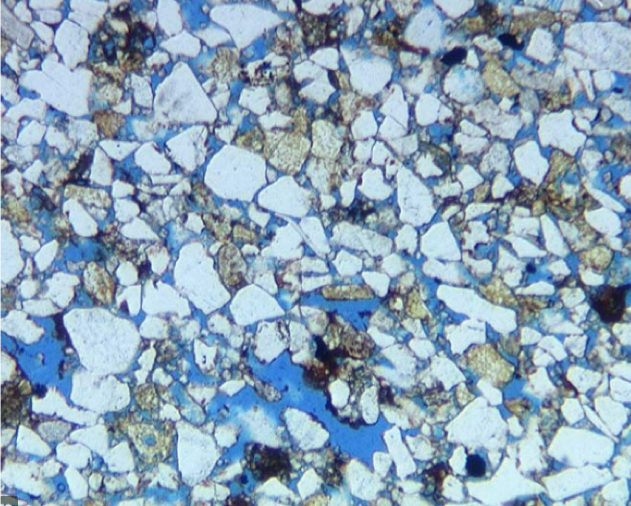
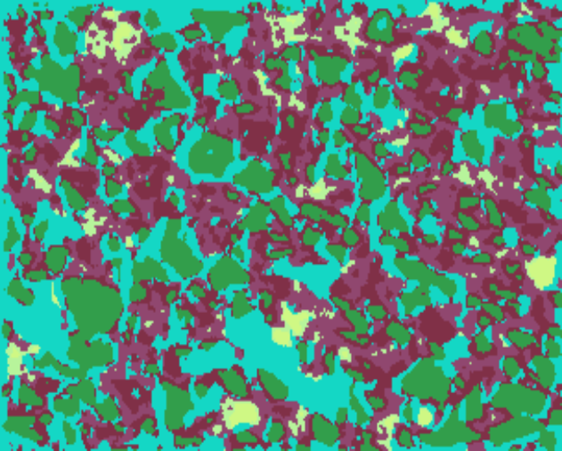
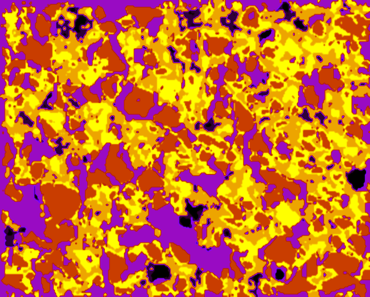

# ThinSection-image-segmentation-Keras
This repository was inspired from Divam Gupta's GitHub repository on Image Segmentation Keras:

https://github.com/divamgupta/image-segmentation-keras

## Objectives
The primary goal in this repository is to discriminate 5 different objects observed in typical clastic rock petrographic thin sections. This is still work in progress and our next objectives will be to classify Petrophysical Rock Types and Petrophysical properties; totally based on Thin Section photomicrograph of the rock. 

## Typical Thin Section
The following image is an example of a typiclal clastic thin section that we are working with in our training and test data:

## Data used for Training
Our primary training data was setup similar to what Mr. Gupta had done for his repository that is mentioned above. Our only exception is that we have used Thin Section images for training and testing:

    dataset1
      --images_prepped_train
      --images_prepped_test
      --annotations_prepped_train
      --annotations_prepped_test

For our training data we have used 40 Thin section images for the intial training with 40 matching annotation images that were created using the methodology explained in the following GitHub repository:

https://github.com/Philliec459/Create-Thin-Section-Image-Labels-for-Image-Segmentation-Training

## Annotated Images
Our annotated images have 5 labeled segments ranging from 1 to 5 representing 5 distinguishable features observed in the Thin Section. We then partition the gray-level image data into different bins which will serve as our labels:

    label = np.zeros(gradient.shape )

    label[gradient < 0.25] = 1 #black grains 
    label[gradient > 0.25] = 2 #darker grains
    label[gradient > 0.4]  = 3 #blue-dye epoxy or visual porosity  
    label[gradient > 0.6]  = 4 #darker grains 
    label[gradient > 0.75] = 5 #bright quartz grains   

## Training Code
For the training portion of the project we used 40 training images and 20 validation images in datset1. These data are not being provided in this repository. The following was our training code:

    from keras_segmentation.models.unet import vgg_unet
    from keras_segmentation.predict import model_from_checkpoint_path

    model = vgg_unet(
            n_classes=51 ,  
            input_height=416, 
            input_width=608 
    )

    model=model_from_checkpoint_path("weights/vgg_unet_1")

    model.train(
        train_images =  "dataset1/images_prepped_train/",
        train_annotations = "dataset1/annotations_prepped_train/",
        val_images="dataset1/images_prepped_test/" ,
        val_annotations="dataset1/annotations_prepped_test/",
        verify_dataset=True,
        load_weights="weights/vgg_unet_1.0" ,
        optimizer_name='adadelta' , do_augment=True , augmentation_name="aug_all",    
        checkpoints_path = "weights/vgg_unet_1" , epochs=5
    )

    #Display the model's architecture
    model.summary()

    #Save the entire model to a HDF5 file.
    #The '.h5' extension indicates that the model should be saved to HDF5.
    model.save('vgg_unet_1.h5') 

    #predict an image from the training data
    out = model.predict_segmentation(
        checkpoints_path="weights/vgg_unet_1" , 
        inp="dataset1/images_prepped_test/43.jpg",
        out_fname="newout.png"
    )

    from keras_segmentation.predict import predict_multiple

    predict_multiple( 
      checkpoints_path="weights/vgg_unet_1" , 
      inp_dir="dataset1/images_prepped_test/" , 
      out_dir="weights/out/" 
    )

## Test Data
For the test data that is provided in this repository we are providing 12 "dataset1/images_prepped_test/" with matching 12 "dataset1/annotations_prepped_test/" image files. We are using the same code as shown above for training except for commenting out the training portion of the code.  

## Predicted Results
The predict_multiple predicted Thin Sections for these test data that were written to "weights/out/". This is an example of the predicted output from this image segmentation process. 

We are predicting 5 primary segments or objects from our test Thin Sections using the python program main_load_your_own_model_from_existing_checkpoint.py where the checkpoint weights are stored int the 'weights/' subdirectory. We are not furnishing the original training data due to the proprietary nature of these data. Our test images were downloaded from the web where we are using similar Thin Sections from clastic rock as was the training set data. 

(At this time I am unable to supply the vgg_unet_1 type of weights file due to a size restriction in GitHub.) 

## Trying to Create a more Intuitive Color Scheme
We would like to re-coloring our predicted results to be a bit more intuitive and match the colors in the original Thin Sections a bit better. Please see the example below as our first attempt of this re-colorization. 

For this step we are using the review_predictions_and_create_better_color_pedictions.py program code gathering the predictions from 'weights/out/' subdirectory and writing out our new color presentations to the 'weights/out_color/' subdirectory. 

We are working in Ubuntu and each python program can be driven from an xterm or Spyder. 

